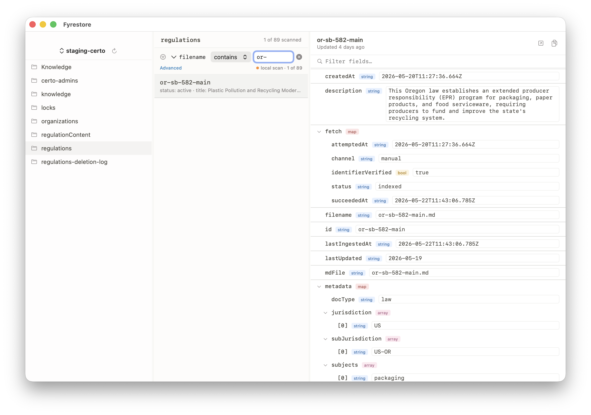

# Fyrestore

A light, read-only macOS browser for Google Firestore. Sign in with your Google account and browse any Firestore project your account has access to.



- **Read-only** — no write or delete endpoints anywhere
- **Single-binary** — pure Swift Package, no Firebase SDK
- **Google sign-in** — one button, your browser, done. Works for any Google account.
- **Three panes** — projects/collections sidebar → document list with filter & pagination → document inspector with sub-collection drill-down

## For users

1. Download the latest `.app` (or clone and `swift run Fyrestore`).
2. Launch → **Sign in with Google** → consent in your browser → you're back in the app.
3. Pick a project, click a collection, browse.

Tokens cache in your macOS Keychain. If you see a *"Google hasn't verified this app"* warning, that's normal — **Advanced → Continue**.

### What you can do

- **Filter** — `field op value` (e.g. `age >= 18`, `name == "alice"`, `email contains "alice"`). Operators: `==`, `!=`, `<`, `<=`, `>`, `>=`, `contains` (case-insensitive substring).
- **Pagination** — first 100 docs load; **Load more** at the bottom fetches the next page.
- **Sub-collections** — chips at the bottom of the doc inspector. Click to drill in; breadcrumb at the top to navigate back up.
- **Copy** — copy any doc as JSON, copy a doc's reference path, right-click for more.
- **Open in Firebase Console** — one-click jump to the hosted UI when you want to make a change.

### Required Google permissions

- `roles/datastore.viewer` on each project you want to browse.
- `roles/browser` (or `roles/resourcemanager.projectViewer`) so the app can list which projects exist for you.

If a project doesn't appear, it's an IAM gap on that project — not a bug.

---

## For maintainers / forking the repo

You need to register your own Google OAuth client once.

### 1. Create the OAuth client (~5 min)

1. <https://console.cloud.google.com/apis/credentials> — pick or create a host project.
2. **OAuth consent screen** → **External**, fill in app info, add scopes: `openid`, `email`, `https://www.googleapis.com/auth/cloud-platform.read-only`, `https://www.googleapis.com/auth/datastore`. Add yourself as a test user.
3. **Create credentials → OAuth client ID → Desktop app** → copy the **Client ID** and **Client secret**.
4. **APIs & Services → Library** → enable **Cloud Resource Manager API** and **Cloud Firestore API**.

### 2. Set up credentials locally

```sh
export FYRESTORE_CLIENT_ID="…apps.googleusercontent.com"
export FYRESTORE_CLIENT_SECRET="GOCSPX-…"
./scripts/setup-secrets.sh
```

This writes `Sources/Fyrestore/Secrets.swift` (gitignored). Without it `swift build` errors with *"cannot find 'Secrets' in scope"*. Per RFC 8252 the Desktop "client secret" isn't actually confidential, but we keep it out of git to satisfy push-protection scanners and to remind forkers to register their own client.

### 3. Build & run

```sh
swift run Fyrestore                    # command line
open Package.swift                      # or open in Xcode and ⌘R
```

### 4. Build a distributable `.app`

```sh
./scripts/make-release.sh
```

Outputs `dist/Fyrestore-<version>.zip` ad-hoc signed and ready for a GitHub Release. Prints the exact `gh release create` line at the end. Drop an `.icns` at `Resources/AppIcon.icns` to bake in a custom icon.

The build is unsigned/un-notarized. First-time users right-click → Open to bypass Gatekeeper. To remove that warning, join the [Apple Developer Program](https://developer.apple.com/programs/) ($99/yr) and add real Developer ID signing + Apple notarization.

### 5. Going from 100 test users to public

While the consent screen is in "Testing": max 100 named test users. To open it to anyone, click **Publish App**, then submit for **OAuth verification** (privacy policy URL + demo video + scope justification — typical turnaround 4–8 weeks). No code changes needed.

## Requirements

- macOS 13+
- Xcode 15+ or Swift 5.9+ (only needed to build from source)
